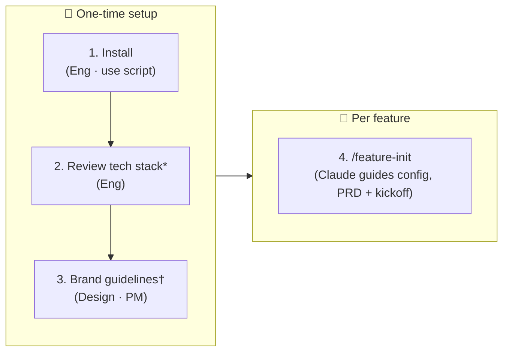

# Getting Started

## Every feature

**New to the workflow?** Run `/feature-init-dry-run` first. Every agent writes a one-line placeholder instead of real content, but all gates, commits, and tracker steps fire for real. Use this to verify wiring before your first real feature.

Run `/feature-init` in Claude Code. Claude will guide you through:
- Toggling phases on/off
- Setting the deployment target
- Capturing any additional context
- Gathering requirements (via PM agent) -- full PRD is written at Stage 1 of the kickoff workflow
- Kicking off the workflow automatically

No manual file editing required. Claude produces `workflow/kickoff-plan.md` for your review and waits for your approval before any work begins.

---

## What to expect at kickoff

Before any agent work begins, Claude runs two setup steps:

**1. Kickoff plan**
Claude reads your `feature-setup.md` and PRD, then produces `workflow/kickoff-plan.md` containing:
- A summary of what it understood
- Any open questions or missing inputs it needs from you
- The next step once you approve

Review it and reply "approved" to continue. If there are open questions flagged, answer them first -- Claude will not proceed until all blockers are resolved.

**2. Delivery tracker seeded**
Once you approve the kickoff plan, Claude writes `workflow/delivery-tracker.md` from your phase config. This is the live execution log for the entire feature -- all stages, steps, human gates, and artifact links will be tracked here as work progresses.

You do not need to edit either file. Claude maintains both throughout the feature.

---

**Human gates**
At each 👤 step, Claude stops and waits for your explicit approval before proceeding. You will see a summary of what was produced and a prompt to approve.

At each 👤💾 step, Claude commits automatically after your approval before moving on.

---

## First-time setup

### Install

Copy agents, rules, skills, and templates into your project:

```bash
bash install.sh          # pull from main
bash install.sh v1.0.0   # pin a specific tag or branch
```

This overwrites everything under `.claude/` except `settings.json`. Commit the result to lock the version.

### Tech stack (optional)

Open [tech-config.md](tech-config.md) and update it to match your project: folder paths, naming conventions, tooling choices. Do this once after install and revisit when conventions change.

### Brand guidelines (optional)

A default brand is included at [skills/brand-guidelines/SKILL.md](skills/brand-guidelines/SKILL.md) (Off-White + Deep Teal, Plus Jakarta Sans, full light/dark token set). Preview it at [skills/brand-guidelines/previews/default-brand.html](skills/brand-guidelines/previews/default-brand.html).

To use your own: replace `SKILL.md` with your color palette, typography, spacing, and component states. Designer, FE, PM, and QA agents all read it before producing any UI work. Note: the macOS Designer uses `macos-hig` instead of `brand-guidelines` -- the HIG defines the platform's design system.

---

## How it works



_* revisit when stack changes · † default included, replace to match your brand_
