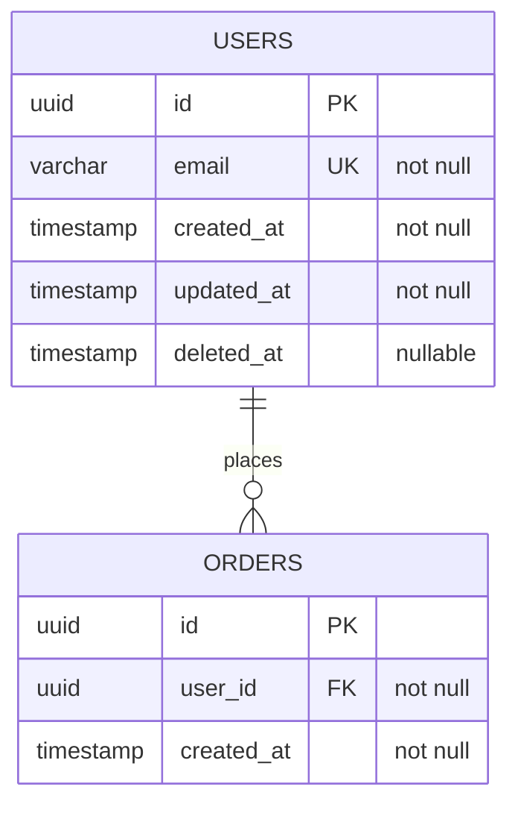

# Rule: DB Schema Changes

Every schema change requires two things in the same commit: a versioned migration file and an updated ER diagram. Neither is optional.

## What counts as a schema change

- Adding, renaming, or dropping a table
- Adding, renaming, dropping, or retyping a column
- Adding or removing a primary key, foreign key, unique constraint, or index
- Changing a column's nullability or default value

## Migration file requirements

- **No raw DDL outside migration files.** Not in seed scripts, not in application bootstrapping, not in ad-hoc Bash commands.
- **Never edit an applied migration.** Once applied to any environment, it is frozen. Fix mistakes with a new migration.
- **One concern per file.** A migration that adds a table must not also alter an unrelated one.
- **Sequential versioning.** Use a timestamp prefix (`V20260516_01__add_users_table.sql`) or the project's migration tool convention. Never reuse or reorder a version number.
- **Reversible by default.** Include a rollback section or paired `undo` file unless the operation is provably irreversible (e.g. data-destructive drops).

## ER diagram requirements

Maintain `src/db/er-diagram.md` as the authoritative snapshot of the live schema -- not a design artifact, not a draft.

For each table include: table name, all columns with type and nullability, primary key, foreign keys and the tables they reference, notable indexes (unique constraints, composite indexes).

Use Mermaid `erDiagram` syntax:

A schema commit without a corresponding ER diagram update is incomplete and must not be merged.

## Enforcement layers (guidance for DevOps setup)

| Layer | Mechanism |
|-------|-----------|
| Database | App DB user has no DDL privileges (SELECT, INSERT, UPDATE, DELETE only); only the migration runner user has DDL rights |
| Migration tool | Flyway/Liquibase with `validateOnMigrate=true` -- detects checksum tampering and out-of-order migrations |
| CI | Schema drift check: apply migrations to a fresh DB, dump the schema, diff against the committed snapshot; fail the build on any divergence |

## Ownership

- **BE** authors migration files and updates the ER diagram for every schema change.
- **DevOps** provisions DB users with correct privilege separation and wires the migration runner into CI/CD.
- **EM** verifies both the migration file and ER diagram are present and approves the DB schema artifact before any downstream work begins (see `contract-first-rule.md`).
