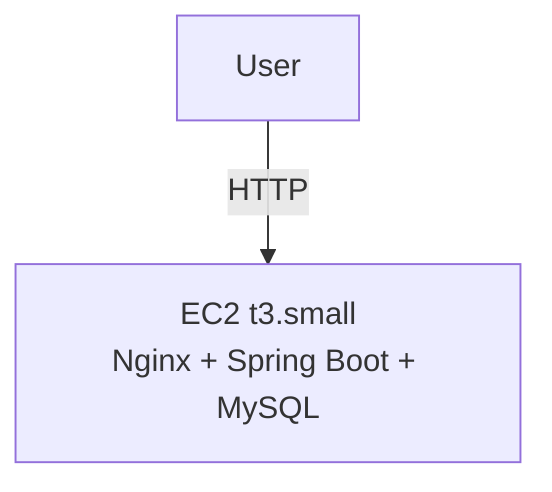
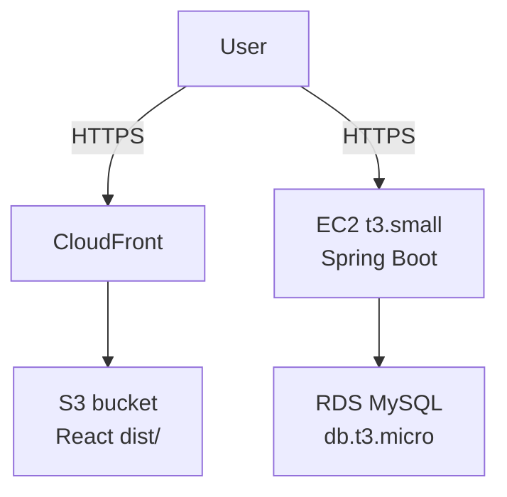

# Terraform Standards

## Deployment Planning

Before writing any Terraform, produce a deployment plan at `generated-docs/architecture/deployment-plan.md` (+ HTML via pandoc per `html-preview-rule.md`). This is a human gate -- no Terraform code until the human approves.

### Step 1: Resolve decisions with the human

Use `AskUserQuestion` to settle these before drafting anything:

- Custom domain or raw AWS URLs?
- Same server or separate BE/FE?
- DB: managed (RDS) or on-EC2 MySQL?
- EC2 instance size and monthly budget ceiling?
- Region?
- HTTPS now or later? (ACM cannot issue certs for raw AWS hostnames -- HTTPS requires a custom domain)
- Database name and DB username the app should connect as? (needed to generate `scripts/db-init.sql`)

### Step 2: Code changes required before provisioning

Call out required code changes in the plan before any AWS work. For a Java/React/MySQL stack:

- Externalize datasource credentials to environment variables per the `java-springboot` skill
- Externalize frontend API base URL to a Vite env var (`VITE_API_URL`)
- Nginx config required if serving FE from EC2

### Step 3: Build strategy

Build locally, deploy artifacts. Run `mvn package -DskipTests` (fat jar) and `npm run build` (`dist/`) on the developer machine, then upload to EC2. Do not install build tools on EC2 -- keeps the instance lean and avoids burning t3.small CPU on Maven. For teams that need CI/CD pipelines, that is a separate infrastructure concern beyond this plan.

### Step 4: Secrets management

Credentials must never be hardcoded in `application.properties`, Terraform, or `user_data`. Store all secrets in AWS SSM Parameter Store (free tier):

- `SPRING_DATASOURCE_URL`
- `SPRING_DATASOURCE_USERNAME`
- `SPRING_DATASOURCE_PASSWORD`

Terraform reads these from SSM at provision time and injects them as environment variables into the BE app via a systemd unit file. The app reads them as standard Spring Boot env vars.

### Step 4a: OTEL agent on EC2

The OTEL Java agent jar must be present on the instance and wired into the systemd unit. Bundle the jar in the deployment artifact (alongside the fat jar) -- do not download it at runtime.

In the systemd unit file (generated by Terraform `user_data` or uploaded via provisioner):

```ini
[Service]
Environment="JAVA_TOOL_OPTIONS=-javaagent:/opt/app/opentelemetry-javaagent.jar"
Environment="OTEL_SERVICE_NAME=my-service"
Environment="OTEL_LOGS_EXPORTER=otlp"
EnvironmentFile=/opt/app/otel.env
ExecStart=/usr/bin/java -jar /opt/app/app.jar
```

Store `OTEL_EXPORTER_OTLP_ENDPOINT` in SSM (not hardcoded) -- it differs between staging and prod -- and write it to `/opt/app/otel.env` at provision time alongside the datasource credentials. This keeps all environment-specific config in one place.

For ECS (Fargate or EC2-backed), set the agent in the container definition environment block and use a sidecar OTEL Collector container in the same task definition:

```json
{
  "environment": [
    { "name": "JAVA_TOOL_OPTIONS", "value": "-javaagent:/opt/otel/opentelemetry-javaagent.jar" },
    { "name": "OTEL_SERVICE_NAME", "value": "my-service" },
    { "name": "OTEL_EXPORTER_OTLP_ENDPOINT", "value": "http://localhost:4317" },
    { "name": "OTEL_LOGS_EXPORTER", "value": "otlp" }
  ]
}
```

The agent jar must be baked into the Docker image -- see the `java-springboot` skill for the Dockerfile pattern.

### Step 5: DB initialisation (on-EC2 MySQL only)

After MySQL is installed, a one-time setup script creates the database and app user. Generate `scripts/db-init.sql` using the database name and username collected in Step 1:

```sql
CREATE DATABASE <db_name>;
CREATE USER '<db_user>'@'localhost' IDENTIFIED BY '<db_password>';
GRANT ALL PRIVILEGES ON <db_name>.* TO '<db_user>'@'localhost';
FLUSH PRIVILEGES;
```

The password is never hardcoded -- it comes from SSM Parameter Store. Run this script once manually after provisioning; do not commit credentials into it.

### Step 6: Always present two options

The plan must offer both:

- **Minimalist** -- lowest cost, fewest AWS services, suitable for testing
- **Production-grade** -- reasonable operational quality, with explicit rationale for each service added beyond minimalist

#### Concrete example: Java + React + MySQL on AWS (us-west-1, past free tier, raw AWS URLs, $30/mo ceiling)

| Decision | Minimalist (~$15/mo) | Production-grade (~$30/mo) |
|---|---|---|
| FE hosting | Nginx on single EC2 | S3 + CloudFront |
| BE hosting | Same EC2 as FE | Separate EC2 |
| DB | MySQL on EC2 | RDS MySQL db.t3.micro |
| EC2 size | t3.small | t3.small |
| Secrets | SSM Parameter Store | SSM Parameter Store |
| HTTPS | HTTP only | Add when custom domain exists |
| Region | us-west-1 | us-west-1 |

Rationale for production extras: S3 + CloudFront separates static asset serving from compute (independent scaling, CDN caching, no EC2 restarts affecting FE); RDS gives automated backups, point-in-time recovery, and eliminates manual MySQL administration on the instance.

### Step 7: Mermaid diagrams

Include a `graph TD` diagram for each option in the plan MD showing components and traffic flow. Example:

````markdown



````

---

## Module structure

Split resources into focused modules by concern. Each module uses the standard HashiCorp file layout:

```
infra/
├── modules/
│   ├── network/
│   │   ├── terraform.tf   # version requirements
│   │   ├── providers.tf   # provider configurations
│   │   ├── main.tf        # primary resources and data sources
│   │   ├── variables.tf   # input variable declarations
│   │   ├── outputs.tf     # output value declarations
│   │   └── locals.tf      # local value declarations
│   ├── compute/
│   └── security/
└── environments/
    ├── dev/
    └── prod/
```

| File | Purpose |
|---|---|
| `terraform.tf` | Terraform version + required providers |
| `providers.tf` | Provider configurations |
| `main.tf` | Primary resources and data sources |
| `variables.tf` | Input variable declarations |
| `outputs.tf` | Output value declarations |
| `locals.tf` | Local value declarations |

---

## Parameterize everything

No hardcoded values -- regions, ports, instance types, and names all go in `variables.tf`:

```hcl
variable "instance_type" {
  description = "EC2 instance type for the app server"
  type        = string
  default     = "t3.medium"
}
```

---

## Output contracts

Expose useful outputs (IPs, ARNs, DNS names) via `outputs.tf` so modules compose cleanly:

```hcl
output "db_endpoint" {
  description = "RDS instance endpoint"
  value       = aws_db_instance.main.endpoint
}
```

---

## Provider and version pinning

Version requirements go in `terraform.tf`, provider config goes in `providers.tf`. Always pin both to avoid surprise upgrades.

```hcl
# terraform.tf
terraform {
  required_version = "~> 1.7"

  required_providers {
    aws = {
      source  = "hashicorp/aws"
      version = "~> 6.0"
    }
  }
}
```

```hcl
# providers.tf
provider "aws" {
  region = var.region
}
```

---

## Naming and tagging

Use `var.project`-`var.env` prefixes on all resource names. Tag every resource with at minimum:

```hcl
tags = {
  project    = var.project
  env        = var.env
  managed-by = "terraform"
}
```

---

## Remote state

Use S3 + DynamoDB lock for any shared or production state. Never commit `.tfstate` files.

```hcl
terraform {
  backend "s3" {
    bucket         = "my-project-tfstate"
    key            = "prod/terraform.tfstate"
    region         = "us-east-1"
    dynamodb_table = "terraform-locks"
    encrypt        = true
  }
}
```

---

## IAM -- least privilege

Scope IAM policies to specific actions and resources. No `*` wildcards unless unavoidable and explicitly documented with a justification comment.

```hcl
# Bad
actions   = ["s3:*"]
resources = ["*"]

# Good
actions   = ["s3:GetObject", "s3:PutObject"]
resources = ["arn:aws:s3:::my-bucket/*"]
```

---

## Sensitive variables

Mark secrets with `sensitive = true`. Never set a default. Source values from SSM Parameter Store or Secrets Manager -- never hardcode.

```hcl
variable "db_password" {
  description = "RDS master password"
  type        = string
  sensitive   = true
}
```

---

## Security groups

Explicit ingress and egress rules only. No `0.0.0.0/0` on SSH or admin ports. Prefer referencing security group IDs over CIDR blocks for internal traffic.

```hcl
# Bad -- open SSH to the world
ingress {
  from_port   = 22
  to_port     = 22
  protocol    = "tcp"
  cidr_blocks = ["0.0.0.0/0"]
}

# Good -- SSH only from bastion SG
ingress {
  from_port       = 22
  to_port         = 22
  protocol        = "tcp"
  security_groups = [aws_security_group.bastion.id]
}
```

---

## Before applying

Run these four steps in order every time:

```bash
terraform fmt -recursive   # format all files consistently
terraform validate         # catch syntax and reference errors
terraform plan             # review what will change
terraform apply            # make it so
```

Never skip steps. Never apply without a reviewed plan. Include the `terraform plan` resource summary in the commit body for any resource-affecting change.
