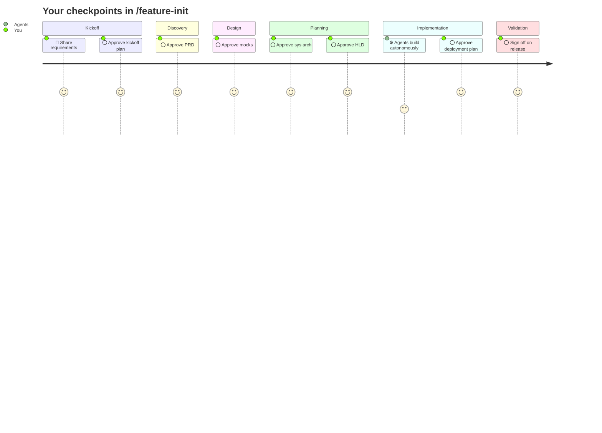

# Claude Code Agents

Give your Claude Code project a full engineering team, not just a single AI assistant.

---

Most AI coding tools work in isolation: one model, one task, one answer. Real software delivery doesn't work that way. It takes product thinking, design, architecture, backend, frontend, QA, and someone to coordinate all of it.

This framework gives you all of that, pre-wired and ready to go.

---

## What you get

A full team of senior-level agents that collaborate the way a real team does:

- **Product Manager:** turns your requirements into a PRD with acceptance criteria
- **UX/UI Designer:** produces mocks; reads your brand before touching anything visual
- **Software Architect:** owns system design and the critical technical decisions
- **Engineering Manager:** the single intake point for engineering; approves every artifact before downstream work starts
- **Backend Engineer:** DB schema, API, auth, and cloud infra
- **Frontend Engineer:** React + TypeScript, state management, routing, integration
- **Swift Engineer:** SwiftUI apps, Xcode config, App Store delivery
- **DevOps Engineer:** CI/CD, IaC, observability, security posture
- **QA Engineer:** test strategy, automation, CI quality gates
- **macOS Designer:** platform-native interfaces following Apple's HIG

---

## Get started in two steps

**1. Install**

```bash
bash install.sh
```

This does the following:

- Copies agents, rules, skills, and templates into `.claude/`
- Copies this README into `.claude/agents-guide.md`
- Scaffolds `BACKLOG.md` in your project root (if it doesn't exist)
- Creates or updates `.gitignore` with standard entries (build output, node_modules, .env, Terraform state, etc.)
- Creates or updates `CLAUDE.md` with `@.claude/tech-config.md` so agents can resolve artifact paths

Commit the result to lock the version.

**2. Run your first feature**

```
/feature-init
```

Claude walks you through setup, gathers requirements, scaffolds the feature folder, and kicks off the full workflow. You approve at every major decision point. Nothing proceeds without you.

Here is what to expect:



---

## Not sure yet?

Run the dry run first:

```
/feature-init-dry-run
```

Every agent writes placeholder output instead of real artifacts. All gates, commits, and progress steps fire for real. You see exactly how it works before committing to a real feature.

---

## How it works

[Read the full guide](docs/how-it-works.md)

---

## Phases and artifact ownership

Agents collaborate by exchanging artifacts. The Gatekeeper is the role with final say: they review, raise concerns, and resolve with the owner before downstream work proceeds.

<details>
<summary>Show phase tables</summary>

### Discovery
| Artifact | Owner | Key collaborators | Gatekeeper |
|---|---|---|---|
| Reqs | User | PM gathers | |
| PRD, ACs | PM | EM reviews | PM |
| Mocks | Designer | PM refines jointly | PM |

### System Design
| Artifact | Owner | Key collaborators | Gatekeeper |
|---|---|---|---|
| Sys Arch | Arch | EM drives, Arch authors | Arch |
| Eng Plans (HLD) | EM | Arch contributes, FE + BE align | EM |

### Engineering Design
| Artifact | Owner | Key collaborators | Gatekeeper |
|---|---|---|---|
| BE Detailed Design | BE | EM monitors; intercepts and collaborates to resolve on red flag | EM |
| FE Detailed Design | FE | EM monitors; intercepts and collaborates to resolve on red flag | EM |
| API Contract | FE + BE | EM monitors; intercepts and collaborates to resolve on red flag | EM |

### Implementation Planning
| Artifact | Owner | Key collaborators | Gatekeeper |
|---|---|---|---|
| Test Plan | QA | EM monitors; intercepts and collaborates to resolve on red flag | EM |
| Issues List | BE / FE / QA | EM signs off each list | EM |

### Implementation
| Artifact | Owner | Key collaborators | Gatekeeper |
|---|---|---|---|
| CI/CD Pipeline + IaC | DevOps | EM monitors; intercepts and collaborates to resolve on red flag | EM |
| Deployment Smoke Check | QA | DevOps hands off live URL; QA runs checks; failures loop back to DevOps | EM |
| BE Artifacts | BE | QA tests, Arch reviews, EM monitors | EM |
| FE Artifacts | FE | QA tests, EM monitors | EM |
| BE Test Docs | BE | QA consumes | EM |
| FE Test Docs | FE | QA consumes | EM |

### Validation
| Artifact | Owner | Key collaborators | Gatekeeper |
|---|---|---|---|
| Automation | QA | EM monitors; intercepts and collaborates to resolve on red flag | EM |

</details>

---

## See also

- [Setup guide](.claude/SETUP-GUIDE.md)
- [Contributing](CONTRIBUTING.md)
