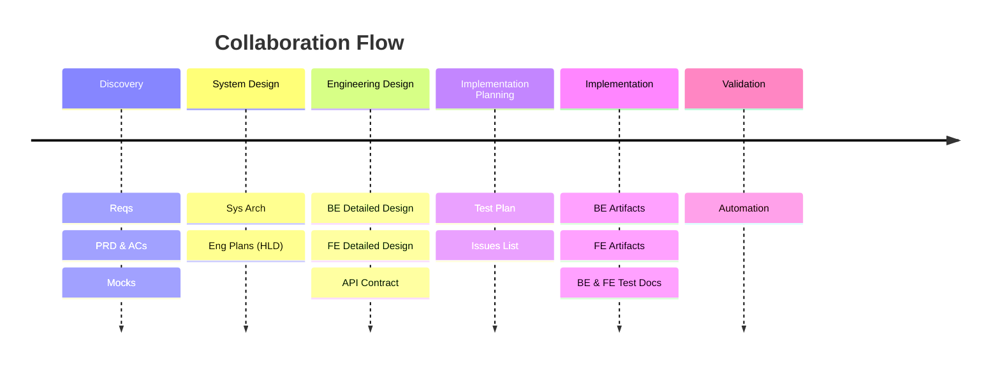
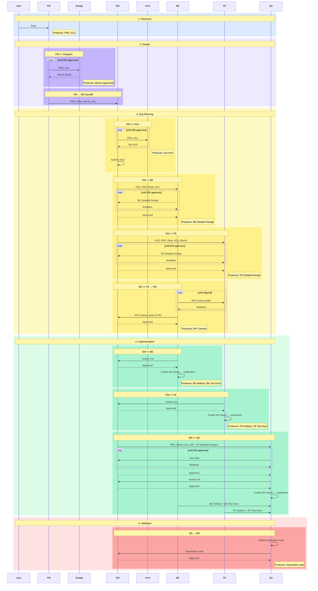
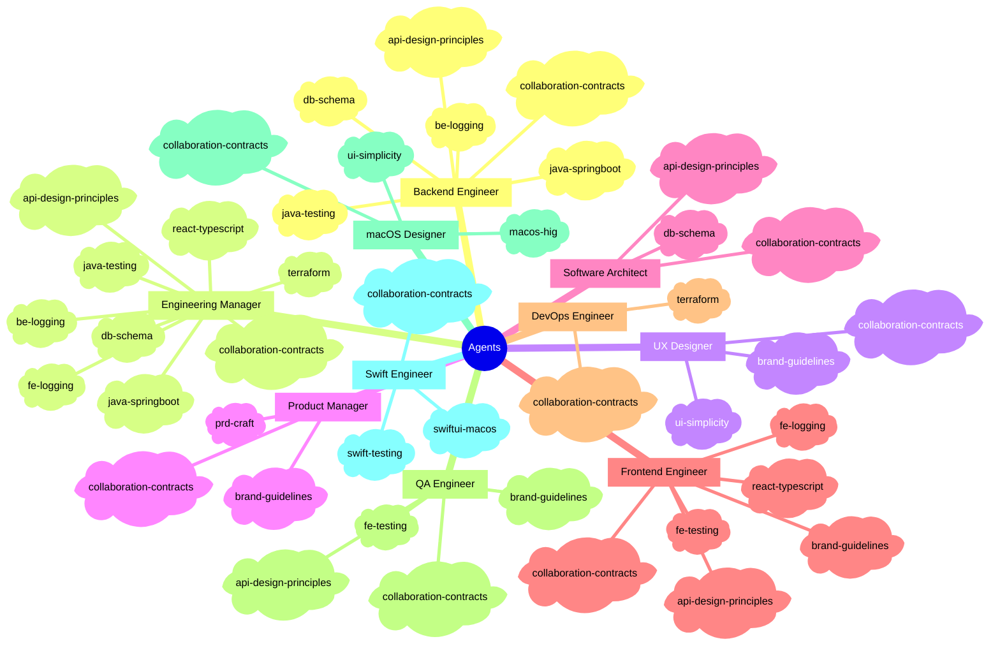

# How it works

## The problem with single-agent AI

When you ask one AI to handle a feature end to end, it tries to be everything at once: product manager, architect, engineer, and QA. It will produce something. But without the checks, handoffs, and specialist constraints a real team applies, it cuts corners you won't notice until later.

This framework applies structure. Each role has a defined scope, a defined output, and defined rules about what it cannot start until something upstream is approved. You get consistent quality because the system is opinionated about sequencing, not just about writing code.

---

## The delivery sequence

Every feature follows this flow. No shortcuts.

```
You
 └─► PM          writes the PRD and acceptance criteria
       └─► Designer   produces mocks; PM reviews jointly
             └─► EM        receives everything; is the single engineering intake point
                   ├─► Arch      designs the system architecture
                   ├─► EM        authors the high-level design (gated on Arch approval)
                   ├─► BE        detailed design + implementation (gated on HLD)
                   ├─► FE        detailed design + implementation (gated on HLD)
                   ├─► BE + FE   jointly author the API contract (gated on both designs)
                   └─► QA        test plan → automation (gated on BE + FE artifacts)
```

Each arrow is a formal contract. Before any agent starts, the artifact it depends on must have `Status: Approved` at the top of the file. That approval is written by the agent who reviewed it, not by you. You approve at the human gates.

---

## Human gates

You are never cut out of the loop. At every major milestone, Claude stops, tells you what was produced, and waits for your sign-off before continuing.

Gates include: PRD, Mocks, System Architecture, High-Level Design, Kickoff Plan, and Delivery sign-off. Between gates, agents run autonomously and track their progress in `workflow/delivery-tracker.md`.

If a session is interrupted for any reason, Claude reads `delivery-tracker.md` first, finds the last confirmed step, verifies the artifact actually exists, and resumes from there. You never lose progress.

---

## How agents know what to do

Each agent is a Markdown file in `.claude/agents/`. Claude Code loads these automatically. Every agent file defines:

- **Ownership:** what this role owns end to end, nothing more
- **Collaboration:** who it works with and how handoffs happen
- **Decision-making:** how this role makes and escalates decisions
- **Communication:** how this role communicates blockers, reviews, and handoffs
- **Hard constraints:** what it will never do, no matter what
- **Commit conventions:** how it formats its git commits

The dependencies between roles (who produces what, who gatekeeps what) live in a single shared skill: `skills/collaboration-contracts/SKILL.md`. Every agent loads it. This is the source of truth for artifact flows. It is never duplicated into individual agent files.

---

## Skills

Agents load domain knowledge packs called skills. A skill is a focused reference document covering one area: REST API design, React + TypeScript patterns, Spring Boot conventions, brand guidelines, macOS HIG, database schema rules.

Skills are loaded progressively. The frontmatter loads at startup. The body loads when the agent actually needs it. Referenced files load on demand. This keeps each session lean.

You can customize any skill by editing its `SKILL.md`. Brand guidelines, tech stack conventions, and API design preferences are all customizable this way.

---

## Customizing for your project

**Tech stack:** open `tech-config.md` and update it to match your tools. This is where agents resolve file paths, naming conventions, and tooling choices. Every artifact path is derived from this file at runtime.

**Brand guidelines:** a default brand (Off-White + Deep Teal, Plus Jakarta Sans, full light/dark token set) ships in `skills/brand-guidelines/SKILL.md`. Replace it with your own palette and typography. Designer, FE, PM, and QA all read it before producing any UI work.

**Pinning a version:** run `bash install.sh v1.2.0` to install a specific tag. Commit the result and your project is locked to that version until you re-run the script.

**File location overrides:** default artifact paths (e.g. `src/db/er-diagram.md`, `BACKLOG.md`) can be overridden in your project's `CLAUDE.md`. See [CONTRIBUTING.md](../CONTRIBUTING.md) for details.

---

## Rules that apply automatically

Rules in `.claude/rules/` are loaded by Claude Code for every session. You do not configure them. They just run.

| Rule | What it enforces |
|------|-----------------|
| `contract-first` | No agent starts work until its upstream artifact is approved |
| `progress-tracking` | `delivery-tracker.md` is the single source of truth; agents check off steps as they complete |
| `delegation` | When a step names a specific role, the orchestrator delegates to that agent; it never self-executes on that role's behalf |
| `workflow-phases` | Multi-step work must be defined as a phased workflow with numbered steps, responsible roles, and concrete artifacts |
| `artifact-review` | At every human-gate artifact, the agent outputs the full markdown content and uses `AskUserQuestion` with Approve / Request changes before proceeding |
| `artifact-paths` | All artifact paths must be resolved from the File locations table in `tech-config.md`; never hardcoded |
| `db-schema-change` | Every schema change requires a versioned migration file and an updated ER diagram in the same commit |
| `product-baseline` | `projects/master/` must reflect the current shipped product before any new feature starts |
| `backlog-reporting` | All agents append discovered bugs and tech debt to `BACKLOG.md` triage; they never self-assign priority |

---

## Folder layout (in your project after install)

```
.claude/
├── agents/           role definitions (auto-loaded by Claude Code)
├── rules/            session rules (auto-loaded by Claude Code)
├── skills/           domain knowledge packs loaded by agents
└── template/         feature and master scaffolding
projects/
├── master/           consolidated product baseline (PRD + mocks, updated after every shipped feature)
└── YYYYMMDD-name/    per-feature folder (scaffolded by /feature-init)
    ├── product-specs/       PM input: PRD
    ├── generated-docs/      all design and planning output
    │   ├── design/          mocks and diagrams
    │   ├── architecture/    system architecture, HLD
    │   ├── contracts/       API contract
    │   └── qa/              test plan
    └── workflow/
        ├── feature-setup.md     phase config and deployment target
        └── delivery-tracker.md  live execution log
src/                  all production artifacts: source code, DB, migrations, IaC
```

---

## Commands

| Command | What it does |
|---------|-------------|
| `/feature-init` | Start a new feature: config, PRD, scaffold, kickoff |
| `/feature-init-dry-run` | Full workflow with placeholder output; all gates fire for real |
| `/fix-gh-issues` | Fetch open GitHub issues and implement fixes |
| `/create-new-agent` | Add a new agent to this repo with full structural verification |

---

## Diagrams

### Step-by-step flow

1. **User** shares requirements with **PM**.
2. **PM** gathers requirements and produces the PRD and ACs.
3. **PM** sends PRD to **Designer**, who creates Mocks. PM reviews and refines jointly with Designer.
4. **PM** sends PRD, Reqs, Mocks, and ACs to **EM**. EM is the single intake point for engineering (no direct PM handoff to BE, FE, QA, or DevOps).
5. **EM** engages **Arch** and collaborates to produce Sys Arch based on PRD and system constraints.
6. **EM** authors Eng Plans (HLD) based on Sys Arch and PRD. Arch contributes; FE and BE align on scope.
7. **EM** kicks off **BE** with HLD, PRD, Reqs, and ACs. BE authors BE Detailed Design and iterates until EM approves.
8. **EM** kicks off **FE** with HLD, PRD, Reqs, ACs, and Mocks. FE authors FE Detailed Design and iterates until EM approves.
9. **FE and BE** jointly author the API Contract, aligned on their Detailed Designs. EM approves before implementation begins.
10. **EM** kicks off **QA** in two waves: first with PRD, Mocks, and ACs (concurrent with BE/FE kickoff) so QA can begin Test Plan authoring; then with approved BE/FE Detailed Designs once available. QA iterates the Test Plan with EM until approved.
11. **BE**, **FE**, and **QA** each independently author their own Issues List and submit to **EM** for sign-off.
12. **EM** approves each Issues List. Each role then creates GH Issues and begins implementation.
13. **BE** implements BE Artifacts per BE Detailed Design and API Contract. **FE** implements FE Artifacts per FE Detailed Design and API Contract.
14. **BE** and **FE** each produce Test Docs for QA to use in automation.
15. **QA** authors the automation suite against FE/BE artifacts and test docs. EM approves before delivery.

---

### Delivery timeline



### Sequence diagram



### Skills by agent


